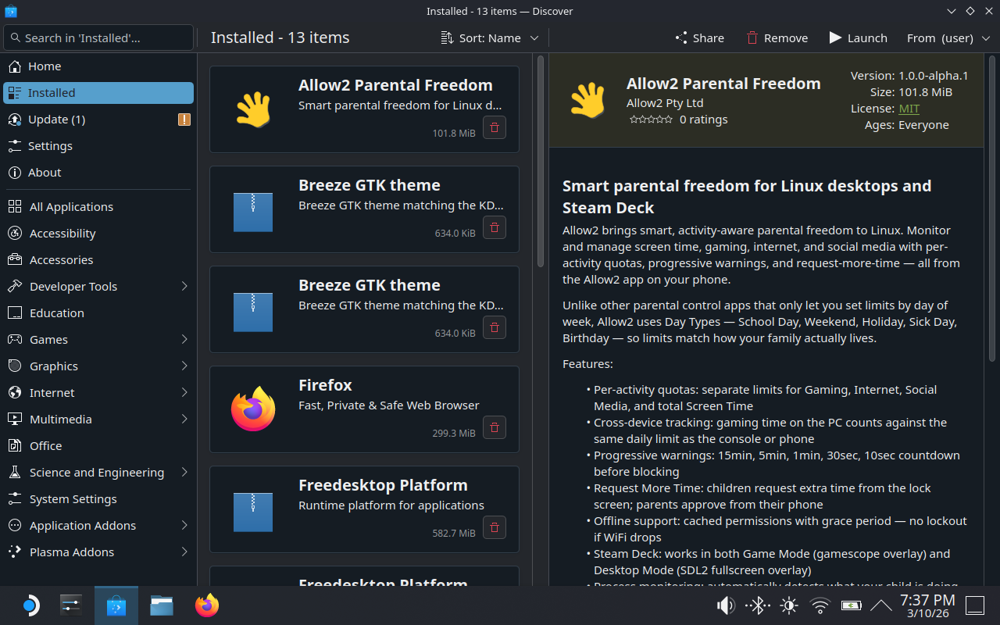
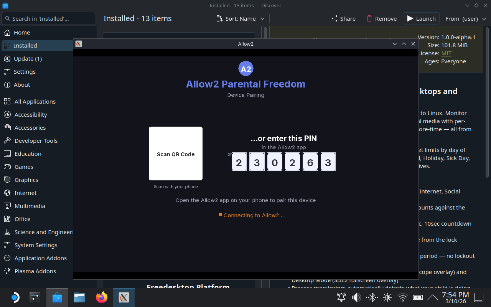

# allow2linux

Parental Freedom for Linux devices, powered by the [Allow2](https://allow2.com) platform.

allow2linux is a background daemon that enforces daily time quotas, allowed hours, activity-specific limits, and offline-safe approval workflows on any Linux device — Steam Deck, desktops, laptops, shared family PCs. Parents manage everything from the Allow2 app on their phone.

## How it works

The daemon runs as a systemd user service. It pairs with the Allow2 platform via a 6-digit PIN or QR code (parents never enter credentials on the child's device), identifies which child is using the device, then continuously enforces their configured limits.

```
Device boot → Child identification → Permission checks (every 30-60s)
                                          │
                              ┌───────────┼───────────┐
                              ▼           ▼           ▼
                           Allowed    Warning     Blocked
                          (continue)  (countdown)  (lock/terminate)
```

### Key features

- **Device pairing** — PIN or QR code deep link, one-time setup
- **Child identification** — OS username mapping, or interactive "Who's playing?" selector with PIN verification
- **Activity enforcement** — per-activity quotas (Gaming, Internet, Social, Screen Time) with stacking
- **Progressive warnings** — 15min → 5min → 1min → 30sec → 10sec → blocked
- **Request More Time** — children can request extra time directly from the lock screen; parents approve/deny from their phone
- **Offline support** — cached permissions with grace period, deny-by-default when offline
- **Steam Deck support** — works in both Game Mode and Desktop Mode with automatic mode switching
- **Process monitoring** — scans `/proc` to detect and classify running applications by activity type

## Architecture

```
┌────────────────────────────────────────────────────────────────┐
│                    allow2linux daemon                           │
│                   (Node.js, systemd --user)                    │
│                                                                │
│  ┌─────────────┐  ┌────────────────────┐  ┌────────────────┐  │
│  │ Allow2 SDK  │  │ Overlay Bridge     │  │ Process        │  │
│  │ (DeviceDaemon│  │                    │  │ Classifier     │  │
│  │  pairing,   │  │  Game Mode:        │  │ (/proc scan,   │  │
│  │  checks,    │  │   Steam browser    │  │  activity map)  │  │
│  │  warnings,  │  │   (HTTP+WS:3001)   │  │                │  │
│  │  requests)  │  │                    │  │                │  │
│  │             │  │  Desktop Mode:     │  │                │  │
│  │             │  │   SDL2 overlay     │  │                │  │
│  │             │  │   (Unix socket)    │  │                │  │
│  └──────┬──────┘  └────────┬───────────┘  └───────┬────────┘  │
│         │                  │                      │           │
│         ▼                  ▼                      ▼           │
│    Allow2 cloud    Fullscreen overlay      SIGTERM/SIGKILL    │
│   (api.allow2.com) (pairing, selector,     (blocked apps)    │
│                     lock, warnings,                           │
│                     request more time)                        │
└────────────────────────────────────────────────────────────────┘
```

### Three packages

| Package | Purpose |
|---------|---------|
| **allow2linux** (`packages/allow2linux/`) | The daemon — wires the SDK to Linux-specific enforcement (process control, overlay, notifications) |
| **allow2** (SDK v2, `../../../sdk/node/`) | The Allow2 Device SDK — pairing, permission checks, warnings, requests, offline support |
| **allow2-lock-overlay** (`packages/allow2-lock-overlay/`) | Native C + SDL2 fullscreen overlay binary for lock screens, child selection, and pairing |

### Overlay display — dual backend

The overlay automatically detects the display mode and uses the appropriate backend:

| Mode | Backend | How it works |
|------|---------|--------------|
| **Game Mode** (gamescope) | Steam browser | HTTP + WebSocket server on port 3001. Opens pages via `steam steam://openurl/`. Embedded HTML/CSS/JS renders all screens. |
| **Desktop Mode** (KDE/GNOME) | SDL2 native binary | Unix domain socket (`/tmp/allow2-overlay.sock`). Native C rendering with SDL2. Fullscreen, always-on-top, bypass window manager. |

**Auto-switching**: If Steam dies mid-session (e.g., user switches from Game Mode to Desktop Mode), the daemon automatically detects this and switches to the SDL2 backend.

Both backends use the same JSON message protocol. Screens: pairing (with QR code), child selector, PIN entry, lock, warning bar, request more time, denied.

### QR code pairing

The pairing screen displays a scannable QR code containing a universal deep link (`https://app.allow2.com/pair?pin=XXXXXX`). On iOS/Android with the Allow2 app installed, this deep links directly to the device connection screen. Without the app, it redirects to the appropriate app store. On desktop browsers, it opens the Allow2 web pairing page.

## Screenshots

| Pairing screen | Connected & waiting |
|:-:|:-:|
|  |  |

## Not Allow2Automate

allow2linux talks **directly to the Allow2 cloud**. It does not require a parent app on the local network.

| | Allow2Automate | allow2linux |
|---|---|---|
| Communication | Agent pulls from parent app on LAN | Daemon calls Allow2 cloud directly |
| Network | Same local network required | Any internet connection |
| Parent device | Must be on network | Not needed — parent uses phone app |
| Use case | Managed home network | Any Linux device, anywhere |

## Development

### Prerequisites

- Node.js 18+
- The allow2 SDK v2 at `../../../sdk/node` (or set `SDK_ROOT`)
- For SDL2 overlay: `gcc`, `libsdl2-dev`, `libsdl2-ttf-dev`, `libx11-dev`

### Run locally

```bash
cd packages/allow2linux
npm install
node src/index.js
```

### Build SDL2 overlay

```bash
cd packages/allow2-lock-overlay
make
```

### Deploy to Steam Deck

```bash
# Fast dev deployment over SSH (syncs source + SDK + rebuilds overlay + restarts daemon)
./flatpak/dev-deploy.sh

# Watch mode — auto-redeploy on file changes
./flatpak/dev-deploy.sh watch

# Custom IP
DECK_HOST=deck@192.168.100.2 ./flatpak/dev-deploy.sh
```

The deploy script handles: Node.js installation on the Deck, file sync, dependency install, SDL2 overlay cross-compilation, systemd service setup, and daemon restart.

## Distribution (planned)

| Format | Target |
|--------|--------|
| Flatpak | Steam Deck, general Linux |
| Snap | Ubuntu and derivatives |
| deb | Debian, Ubuntu, Mint, Pop!_OS |
| rpm | Fedora, RHEL, openSUSE |
| AppImage | Any Linux (portable) |
| AUR | Arch, Manjaro |

## License

See [LICENSE](LICENSE) file.
